# DATA 260 Homework 2 Report

## Student and Configuration

- Student: Vrishin Dharmesh Kunnatham Parambath
- SID4: 8844
- PORT_BASE: 8744
- PREFIX: s8844
- SEED: 8844
- VERIFY_SEED: 268844
- DOMAIN_ID: 4
- Assigned domain: Open-source package vulnerabilities
- Model: qwen3:8b
- Hardware: Windows 11 laptop
- Final tag: hw2
- GitHub repository: https://github.com/Viki2183/data260-8844

## Part 1 — HTML and CSS

The HW1 vulnerability form was extended with a responsive layout. The page uses an external `styles.css` file and includes a mobile media query for narrow screens, including a 375px-wide display.

The interface includes:

- A vulnerability report submission form
- A search form
- Report cards
- Edit and delete buttons
- A visible loading state
- A visible empty state
- A visible error state

The page was tested through the Dockerized application at:

`http://127.0.0.1:8744`

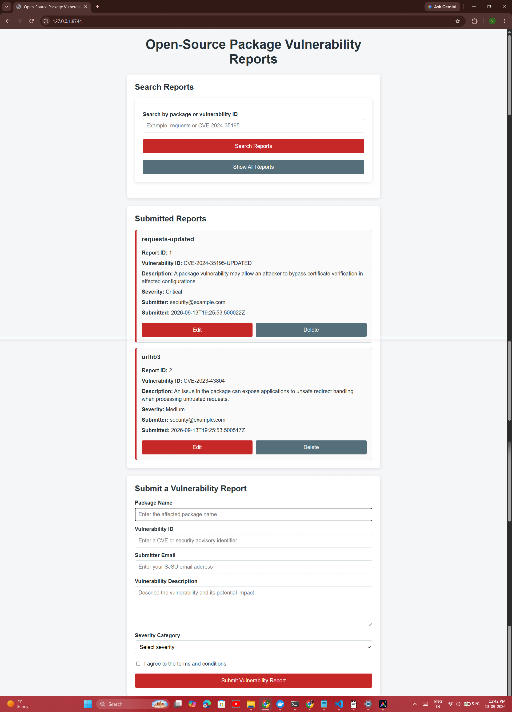

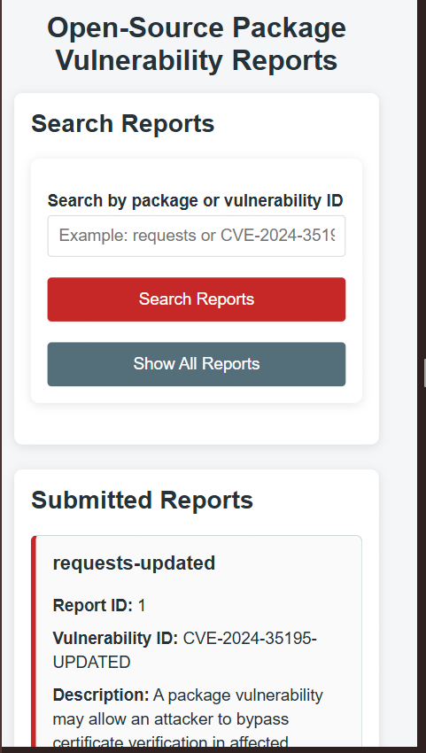

## Part 2 — FastAPI

The FastAPI backend runs on `PORT_BASE` 8744 and provides REST endpoints for vulnerability reports.

### Part 2.1 — Create a Record

The frontend sends a POST request to `/api/vulnerability-reports`. A new report was created successfully and returned API ID 3.

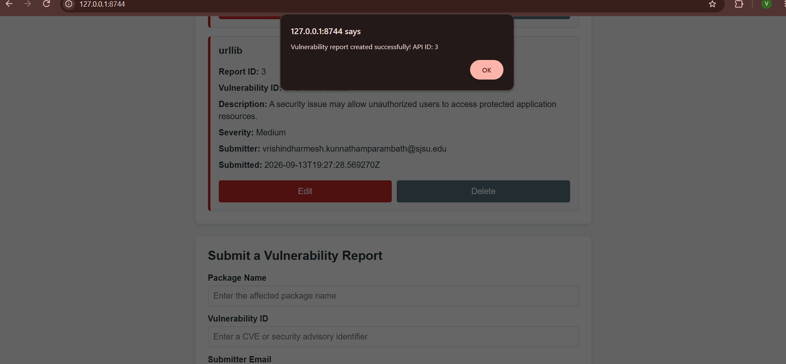

### Part 2.2 — Update Record ID 1

The report with ID 1 was edited through the webpage. Its package name was changed to `requests-updated`, its vulnerability ID was changed to `CVE-2024-35195-UPDATED`, and its severity was changed to `Critical`.

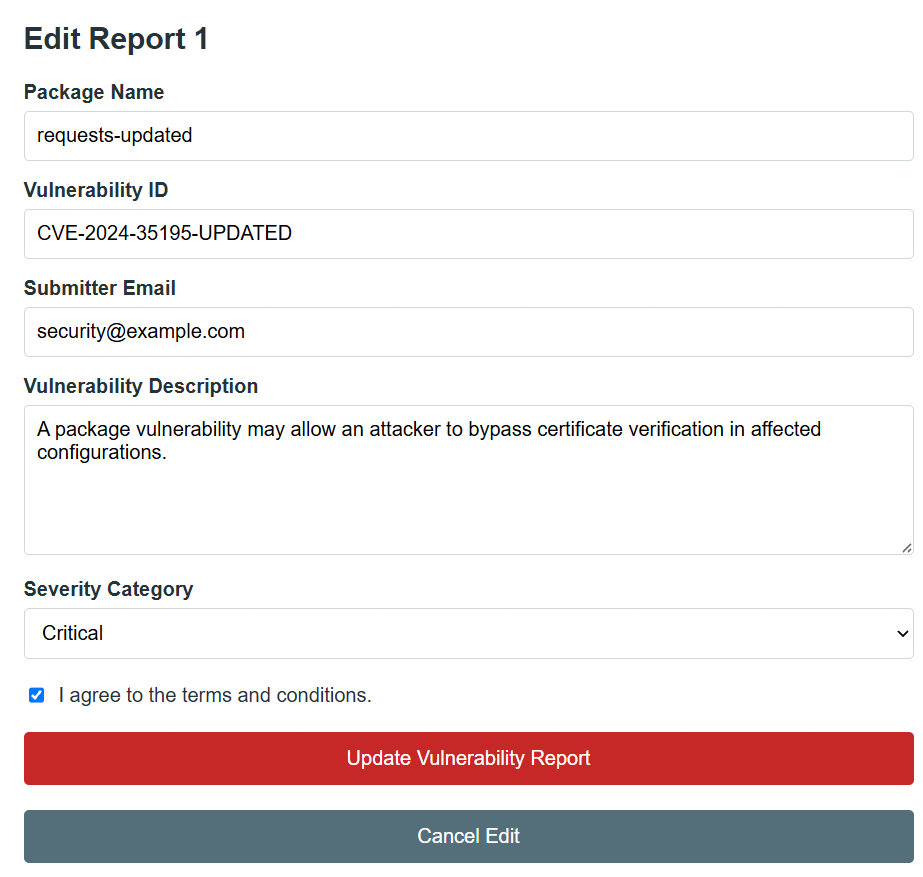

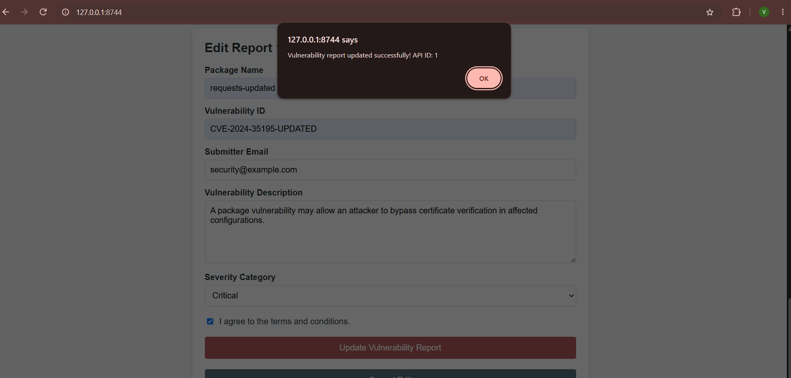

### Part 2.3 — Delete the Highest-ID Record

The temporary highest-ID report, Report ID 4, was deleted through the webpage. The success message confirmed the deletion, and the refreshed report list showed that Report ID 4 was no longer present.

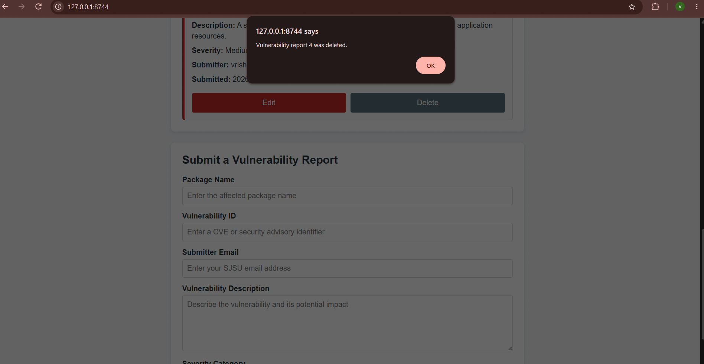

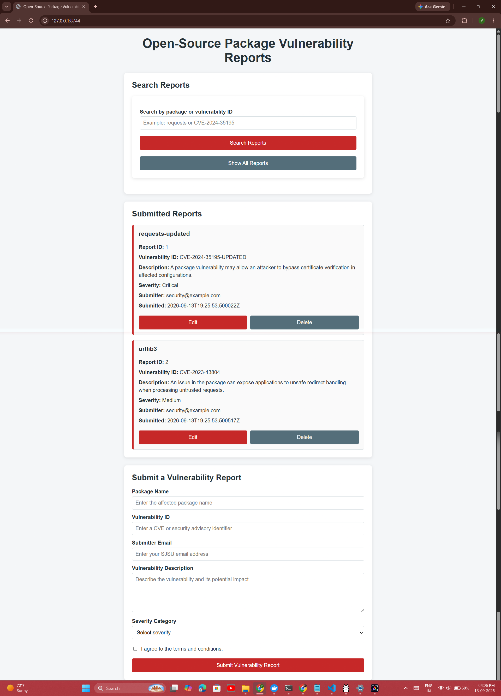

### Part 2.4 — Search

Searching for `requests` returned only the matching report.

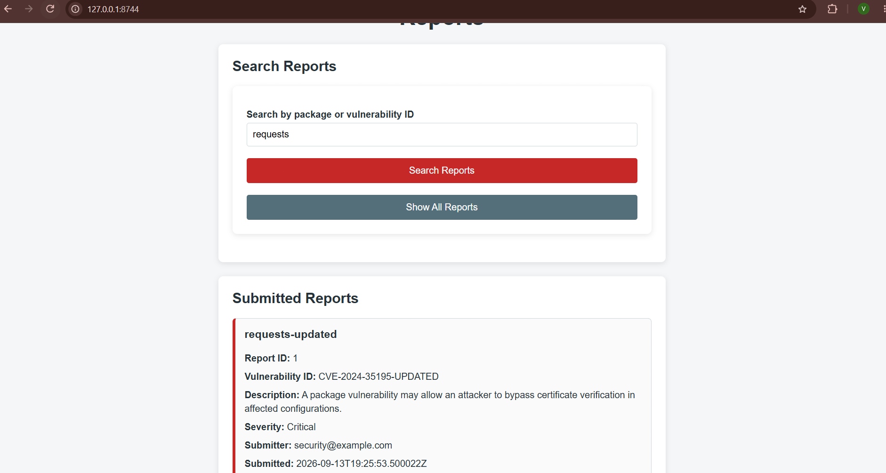

## Part 3 — Stateful Agent Graph

The sequential HW1 workflow was extended into a stateful LangGraph workflow in `code/hw2_graph.py`.

All LLM calls in `hw2_graph.py`, including the Planner and Reviewer nodes, are routed through the shared HW1 adapter in `src/model_client.py`. This preserves the common Ollama configuration and token-accounting behavior.

The graph contains:

- `AgentState`, which stores shared workflow memory
- A Planner node
- A Reviewer node
- A Supervisor node
- Conditional routing logic
- A turn counter to prevent infinite loops
- A retry path when validation or review fails

The Planner output is validated with Pydantic. The schema requires exactly three distinct string tags, each between 3 and 30 characters, and a summary containing no more than 25 words.

The graph was tested with the local `qwen3:8b` model. The test completed in 3 supervisor turns, and the Reviewer approved the output.

The final output contained exactly three tags:

- `AuthenticationBypass`
- `RequestsPackage`
- `UnauthorizedAccess`

The generated summary was within the 25-word limit.

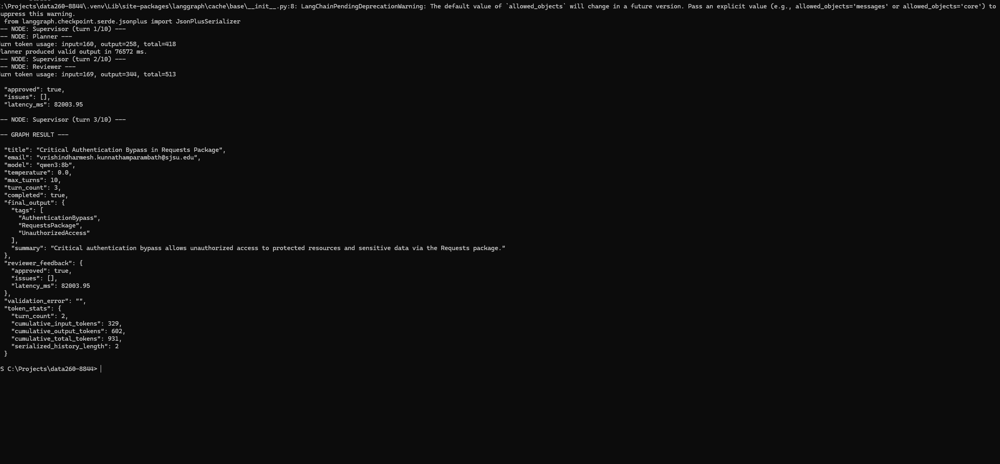

## Part 4 — Schema Validation and Loop Safety

### Schema Validation Experiment

The frozen input was stored in:

`reports/hw02/cases/schema_input.json`

The input was run 30 times.

| Outcome | Count |
|---|---:|
| Valid first attempt | 30 |
| Valid after 1 retry | 0 |
| Valid after 2 or more retries | 0 |
| Hit turn ceiling | 0 |

Completion rate: 100%

Mean latency: 178,399.88 ms

### Turn Ceiling Comparison

Each ceiling was tested 20 times using the same frozen input and model settings.

| Turn ceiling | Runs | Completed | Completion rate | Mean latency |
|---:|---:|---:|---:|---:|
| 2 | 20 | 0 | 0% | 71,869.60 ms |
| 10 | 20 | 20 | 100% | 157,746.71 ms |

A ceiling of 2 was too small because the workflow normally requires Supervisor, Planner, and Reviewer turns before it can finish.

A ceiling of 10 completed all runs successfully, so ceiling 10 was selected for deployment.

### Adversarial Experiment

The adversarial input was stored in:

`reports/hw02/cases/adversarial_input.json`

It was run five times.

| Outcome | Count |
|---|---:|
| Completed | 5 |
| Hit turn ceiling | 0 |

Completion rate: 100%

Observed ceiling rate: 0%

Mean latency: 134,891.41 ms

The adversarial input was designed to create difficulty by combining ambiguous wording, conflicting instructions, and content that could cause the Planner or Reviewer to produce output that violates the required schema. Such input could lead to invalid tags, an overly long summary, repeated correction attempts, or a turn-ceiling failure.

In the five observed runs, the graph completed successfully every time and did not reach the turn ceiling. This observed result is reported honestly rather than claiming that the input reliably causes failure. One improvement would be to add stronger schema-aware retry feedback that explicitly identifies the invalid field and requires the next model response to correct only that field. A separate maximum retry limit would also prevent repeated correction loops.

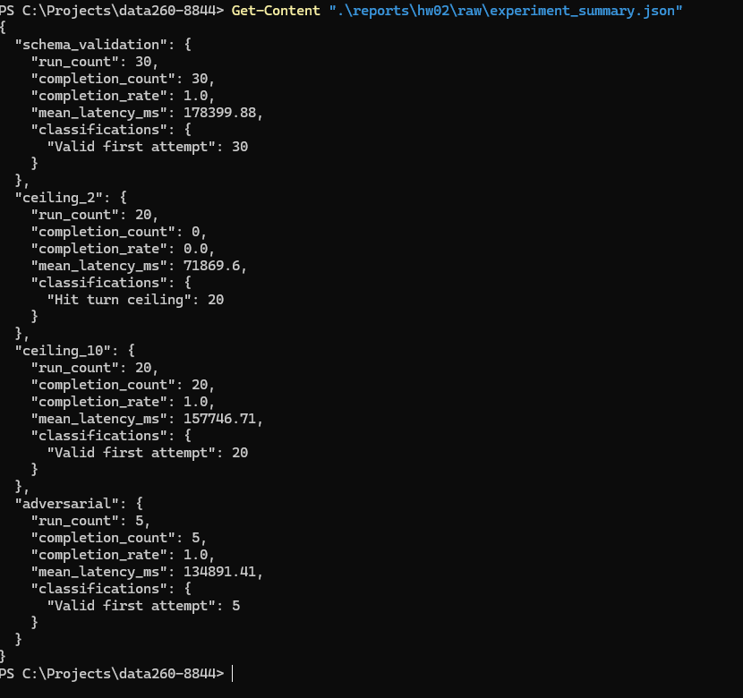

## Docker Deployment

The FastAPI application was packaged in a Docker image named:

`data260-8844-hw2`

The container was started with:

```powershell
docker run -d -p 8744:80 --name data260-8844-hw2-container data260-8844-hw2
```

The container started successfully, and the API responded with HTTP 200. The webpage also loaded successfully from the Docker container.

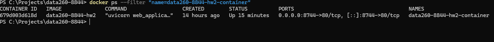


## Verification

The verification script is:

`code/verify_hw02.py`

It checks:

- Required HW2 files
- FastAPI API response
- LangGraph smoke-test completion

The final verification produced:

```json
{
  "all_passed": true
}
```

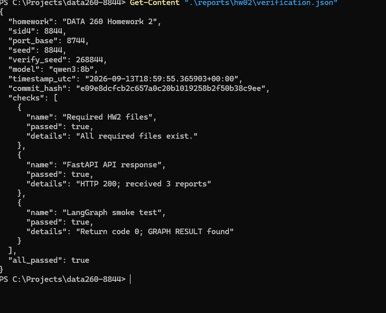

## Reproducibility

The following files contain the reproducible HW2 evidence:

- `reports/hw02/RUN_LOG.txt`
- `reports/hw02/raw/schema_validation_results.json`
- `reports/hw02/raw/schema_validation_results.csv`
- `reports/hw02/raw/ceiling_comparison_results.json`
- `reports/hw02/raw/ceiling_comparison_results.csv`
- `reports/hw02/raw/adversarial_results.json`
- `reports/hw02/raw/experiment_summary.json`
- `reports/hw02/verification.json`

The main commands are:

```powershell
python .\code\run_hw02_experiments.py
python .\code\verify_hw02.py
docker build -f .\code\Dockerfile -t data260-8844-hw2 .
docker run -d -p 8744:80 --name data260-8844-hw2-container data260-8844-hw2
```

## Conclusion

This homework extended the HW1 vulnerability-report application into a Dockerized FastAPI application with CRUD operations, search, responsive styling, visible interface states, and a stateful LangGraph agent workflow. The measured experiments showed that a turn ceiling of 10 was reliable for the tested input, while a ceiling of 2 was insufficient.